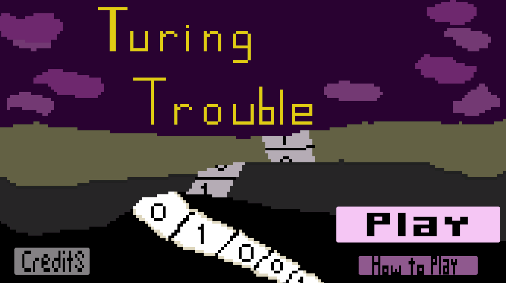
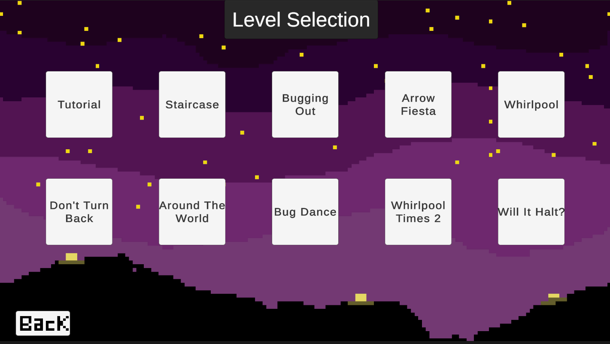
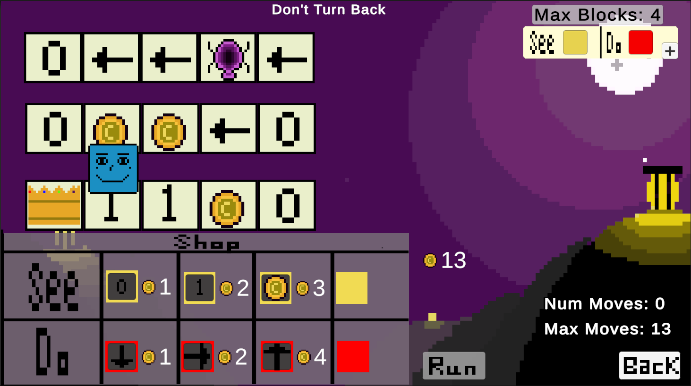
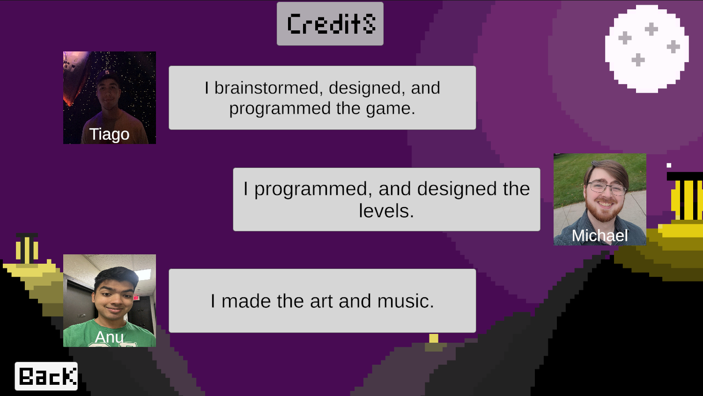

## Links
[Play on Itch.io Here](https://tdavies.itch.io/turing-trouble)  
[Hackathon DevPost Here](https://devpost.com/software/turing-trouble)

## Introduction
In a world where Alan is stuck on a Multi-Tape Turing machine, only you can guide our hero to victory by making the correct transition functions. Use our game to learn about simple transition functions and HAVE FUN!

## Code Description
Coded in C# using Unity by Tiago Davies, and Michael Reidy. We created a modular design for levels by using Scriptable Objects (Unity built in data container) to define the crucial information of each level. From there we dynamically load the information into GameObjects that appear on your screens! This made our level development extremely simple as complexity is abstracted away, and making a new level is as simple as setting a few fields in the Unity Editor.

## Project Timeline / Awards
We made this game for DandyHacks'23, which lasted 43 hours. It went on to get **1st place in entertainment track** and **won most creative use of GitHub**.

## Gameplay
Drag the different blocks from the SHOP into the corresponding places of the same color to define a transition function. Once you are satisfied with the transition table you have made press RUN, and watch Alan move along the tape. If he makes it to the crown you WIN! Watch out for obstacles along your way, and try to make it to the end!

## Future
We would like to add a state mechanic that changes what Alan does accoring to the SEE blocks to further draw similarities between this game and actual Turing Machines. Due to lack of time, however, we had to go for a more streamlined approach.

## Game Screenshots

